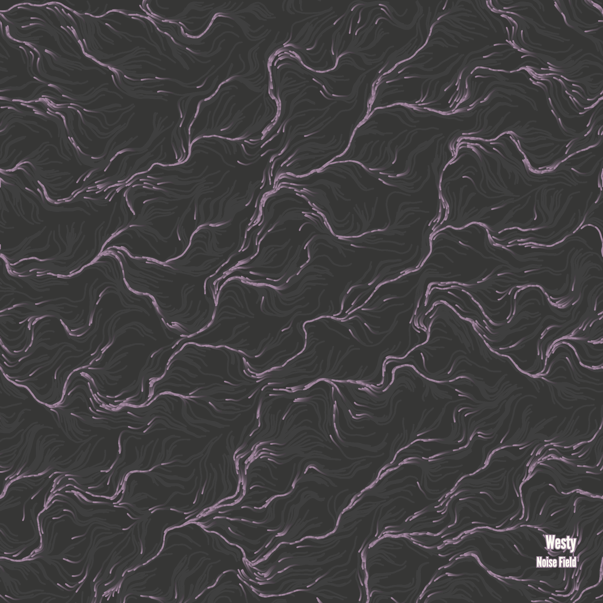

<h1  align="center"><b>Perlin Noise Flow Fields</b></h1>

This is a personal attempt to try a generative art method to create an album cover. I won't bother you with the theory but I will leave some interesting links to better understand the concepts behind the code, then I will talk a bit about some details for an album cover.

<h3>Theory and resources</h3>

This video is a great explanation of what flow fields are and how to use them to create art:
<iframe width="560" height="315" src="https://www.youtube.com/embed/JlU3GskkcUw" title="YouTube video player" frameborder="0" allow="accelerometer; autoplay; clipboard-write; encrypted-media; gyroscope; picture-in-picture" allowfullscreen></iframe>

My code started out from this __The Coding Train__ video, but I've made some modifications and performance improvements:
<iframe width="560" height="315" src="https://www.youtube.com/embed/BjoM9oKOAKY" title="YouTube video player" frameborder="0" allow="accelerometer; autoplay; clipboard-write; encrypted-media; gyroscope; picture-in-picture" allowfullscreen></iframe>

<h3>Let's make an album cover!</h3>

So, if you to make an album cover you should take into account the parameters that directly affect the animation, the resolution and maybe the framerate.

I have marked all the important parameters that you should check with `// MOD`.

Now, if you want to create an album cover, I suggest you use a resolution between 3000x3000 and 5000x5000 pixels. If you compile the code in a web browser, you may find a low framerate animation but still can get away with it by just taking a screenshot.

However, if you want to generate an animated video, you could use __CCapture.js__ but I suggest you use another compiler rather than the web browser. I may work on this anytime soon...

<h3>Some examples</h3>

You can find different results just by letting the animation run for a couple seconds. These two examples come from the same run:

 

I also want to show this one that appeared when the code wasn't ready yet:

<h3>That's all for now</h3>

The credit of this code should go to __The Coding Train__.

However, if you want to show support to me, you can listen to [my music](https://linktr.ee/westy_music) and tell me what you think of it.
Bye!
